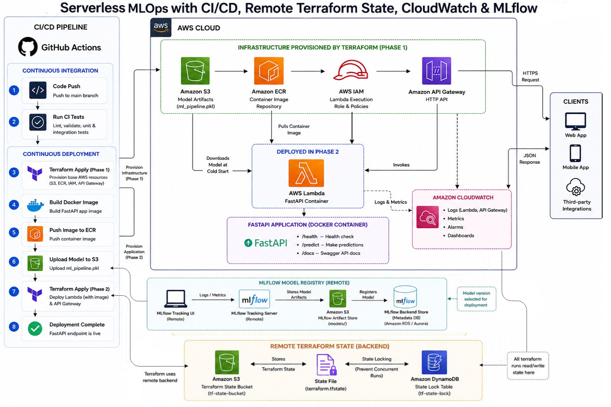

# Serverless MLOps Pipeline on AWS

An end-to-end **MLOps / DevOps deployment project** that packages a
FastAPI machine-learning inference service into Docker, provisions AWS
infrastructure with Terraform, and automates deployment using GitHub
Actions.

## Architecture



The architecture combines:

-   FastAPI inference API
-   Docker containerization
-   GitHub Actions CI/CD
-   Terraform Infrastructure as Code
-   Amazon ECR for container images
-   Amazon S3 for model artifacts
-   AWS Lambda for serverless inference
-   API Gateway for the public HTTP API
-   IAM for execution permissions
-   CloudWatch for logs, metrics, alarms and dashboards
-   Remote Terraform state
-   Remote MLflow tracking/model registry

> **Implementation status:** The core FastAPI + Docker + Terraform +
> GitHub Actions + S3 + ECR + Lambda + API Gateway deployment is
> implemented. Remote Terraform state, CloudWatch monitoring and remote
> MLflow are architectural extensions to add next.

------------------------------------------------------------------------

## Project Flow

``` text
Developer
   |
   | Push / Pull Request
   v
GitHub
   |
   v
GitHub Actions
   |
   +---- CI
   |      - Terraform fmt
   |      - Terraform validate
   |      - Docker build
   |
   +---- CD
          |
          +--> Terraform Apply - Phase 1
          |       |
          |       +--> S3
          |       +--> ECR
          |       +--> IAM
          |
          +--> Build Docker image
          |
          +--> Push image to ECR
          |
          +--> Upload model to S3
          |
          +--> Terraform Apply - Phase 2
                  |
                  +--> Lambda
                  +--> API Gateway
                          |
                          v
                     FastAPI API
```

------------------------------------------------------------------------

# Application

The inference service is built with:

-   Python
-   FastAPI
-   Pydantic
-   Scikit-learn
-   Docker

Example endpoints:

``` text
GET  /home
POST /predict2
```

FastAPI also exposes automatic OpenAPI / Swagger documentation.

------------------------------------------------------------------------

# AWS Infrastructure

## Amazon S3

Stores the trained model artifact:

``` text
ml_pipiline.pkl
```

Lambda downloads the model from S3 when required by the application.

## Amazon ECR

Stores the Docker image containing the FastAPI inference application.

Images are tagged with the Git commit SHA:

``` text
<repository-url>:<git-sha>
```

This makes deployments immutable and traceable.

## AWS Lambda

Runs the FastAPI application as a container image.

Lambda is deployed only after the required container image exists in
ECR.

## API Gateway

Provides the public HTTP API endpoint and invokes Lambda.

## IAM

Provides Lambda with permissions to:

-   write execution logs
-   read the model artifact from S3

------------------------------------------------------------------------

# Why Terraform Is Applied Twice

Lambda requires a container image that must already exist in ECR.

However, ECR itself is created by Terraform.

That creates a dependency:

``` text
Terraform creates ECR
        |
        v
GitHub builds and pushes image
        |
        v
Terraform creates Lambda using image
```

Therefore the deployment is divided into two Terraform phases.

### Phase 1

``` bash
terraform apply
```

`deploy_lambda` defaults to `false`.

Terraform provisions the foundation:

``` text
S3
ECR
IAM
API Gateway
```

Lambda-dependent resources are skipped.

### Artifact publication

GitHub Actions then:

``` text
Build Docker image
       |
       v
Push image to ECR
       |
       v
Upload model to S3
```

The Docker image is tagged with:

``` text
github.sha
```

### Phase 2

Terraform is applied again:

``` bash
terraform apply   -var="deploy_lambda=true"   -var="image_tag=<git-sha>"
```

Lambda and its API Gateway integration are now deployed using the image
that was just pushed.

------------------------------------------------------------------------

# CI/CD

## Continuous Integration

CI runs when:

-   code is pushed to `dev`
-   a pull request targets `main`

Current checks:

``` text
Checkout
   |
   v
Terraform Init
   |
   v
Terraform Format Check
   |
   v
Terraform Validate
   |
   v
Docker Build
```

The pipeline is intentionally lightweight for the current project.
Automated unit and integration tests can be added as the application
grows.

## Continuous Deployment

CD runs when code is pushed to `main`.

``` text
Checkout
   |
   v
Configure AWS
   |
   v
Terraform Init
   |
   v
Terraform Apply - Phase 1
   |
   v
Read Terraform Outputs
   |
   +--> S3 bucket name
   |
   +--> ECR repository URL
   |
   v
Login to ECR
   |
   v
Build Docker image
   |
   v
Push image using Git SHA
   |
   v
Upload model to S3
   |
   v
Terraform Apply - Phase 2
   |
   v
Deploy Lambda
   |
   v
Live API Gateway endpoint
```

------------------------------------------------------------------------

# Immutable Docker Tags

The same Git commit SHA is used throughout the deployment:

``` yaml
${{ github.sha }}
```

The relationship is:

``` text
Git commit
    |
    v
Docker image tag
    |
    v
ECR image
    |
    v
Lambda image_uri
```

This allows the deployed Lambda version to be traced back to the exact
source commit.

------------------------------------------------------------------------

# Terraform Outputs

Terraform exposes deployment information:

``` hcl
output "bucket_name" {
  value = aws_s3_bucket.model_bucket.bucket
}

output "repository_url" {
  value = aws_ecr_repository.image_repo.repository_url
}

output "api_gateway_url" {
  value = aws_apigatewayv2_api.model_api.api_endpoint
}
```

GitHub Actions reads these outputs instead of hardcoding AWS resource
URLs.

------------------------------------------------------------------------

# Remote Terraform State

The production-oriented architecture uses a remote Terraform backend:

``` text
GitHub Actions
      |
      v
Terraform
      |
      v
S3 Terraform State Bucket
      |
      +--> terraform.tfstate

DynamoDB
      |
      +--> State locking
```

This prevents Terraform state from disappearing with a temporary GitHub
Actions runner.

The desired lifecycle is:

``` text
Runner 1
   |
   +--> Read state
   +--> Apply changes
   +--> Write state
   |
   v
Runner destroyed

Runner 2
   |
   +--> Read same state
   +--> Continue managing infrastructure
```

State locking prevents concurrent Terraform runs from modifying the same
state at the same time.

------------------------------------------------------------------------

# MLflow Model Lifecycle

The extended MLOps architecture uses a remote MLflow setup for
experiment tracking and model management.

``` text
Data Scientist / Training
          |
          v
MLflow Tracking Server
       /              /           Metrics       Artifacts
                  |
                  v
             Amazon S3
             Artifact Store
                  |
                  v
          MLflow Model Registry
                  |
                  v
          Selected Model Version
                  |
                  v
           Deployment Pipeline
                  |
                  v
              AWS Lambda
```

MLflow can track:

-   experiments
-   parameters
-   metrics
-   model artifacts
-   model versions

A remote MLflow deployment can use S3 for model artifacts and a remote
metadata backend for experiment and registry information.

------------------------------------------------------------------------

# CloudWatch Monitoring

The deployed application can be monitored with Amazon CloudWatch.

The monitoring layer can capture:

-   Lambda logs
-   API Gateway logs
-   invocation metrics
-   errors
-   latency
-   alarms
-   dashboards

Conceptually:

``` text
API Gateway
     |
     v
  Lambda
   /    /    Logs   Metrics
  \     /
   \   /
 CloudWatch
     |
     +--> Alarms
     |
     +--> Dashboards
```

------------------------------------------------------------------------

# Repository Structure

``` text
terraform-actions-project/
│
├── .github/
│   └── workflows/
│       ├── ci.yml
│       └── cd.yml
│
├── terraform-infra/
│   ├── main.tf
│   ├── providers.tf
│   ├── variables.tf
│   └── outputs.tf
│
├── app.py
├── Dockerfile
├── requirements.txt
├── ml_pipiline.pkl
├── architecture.png
└── README.md
```

Terraform is kept in one root module so the AWS resources share one
Terraform state.

------------------------------------------------------------------------

# Authentication

The current GitHub Actions workflow uses GitHub Secrets:

``` text
AWS_ACCESS_KEY_ID
AWS_SECRET_ACCESS_KEY
AWS_REGION
```

A future improvement is **GitHub Actions OIDC + AWS IAM role
assumption**, eliminating long-lived AWS access keys from GitHub
Secrets.

------------------------------------------------------------------------

# Deployment

## Local Terraform

``` bash
cd terraform-infra

terraform init

terraform fmt -recursive

terraform validate
```

## CI

Push to `dev`:

``` bash
git add .
git commit -m "Update application"
git push origin dev
```

CI runs automatically.

Create a pull request:

``` text
dev -> main
```

CI runs again for the pull request.

## CD

After the pull request is merged into `main`, CD automatically:

1.  Provisions the AWS foundation.
2.  Reads Terraform outputs.
3.  Builds the FastAPI Docker image.
4.  Pushes the image to ECR.
5.  Uploads the model to S3.
6.  Deploys Lambda using the exact Git SHA image.
7.  Exposes the API through API Gateway.

------------------------------------------------------------------------

# Technologies

``` text
Python
FastAPI
Docker
Terraform
GitHub Actions
AWS Lambda
Amazon ECR
Amazon S3
API Gateway
IAM
CloudWatch
MLflow
```

------------------------------------------------------------------------

# Future Improvements

-   [ ] Remote Terraform backend
-   [ ] Terraform state locking
-   [ ] GitHub Actions OIDC authentication
-   [ ] Remote MLflow Tracking Server
-   [ ] MLflow Model Registry integration
-   [ ] Automated model promotion
-   [ ] CloudWatch alarms and dashboards
-   [ ] Automated API/integration tests
-   [ ] Dev / staging / production environments
-   [ ] Automated rollback strategy
-   [ ] Model versioning and deployment approval gates

------------------------------------------------------------------------

# Project Goal

The goal is to demonstrate the complete path from a machine-learning
application to a reproducible cloud deployment:

``` text
ML Model
   |
   v
FastAPI
   |
   v
Docker
   |
   v
GitHub
   |
   v
CI/CD
   |
   v
Terraform
   |
   v
AWS
   |
   +--> S3
   +--> ECR
   +--> Lambda
   +--> API Gateway
   +--> CloudWatch
```

The architecture provides a foundation for reproducible infrastructure,
immutable deployments, model lifecycle management, monitoring, and
production-oriented MLOps.
